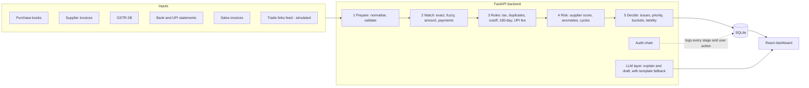

# HisabKitab — Architecture

Team Fintastic · Fintechstico prototype · PS2: Intelligent Tax Reconciliation
Status: v1 (pre-design-template). Source of truth for structure, data contracts and algorithms.

---

## 1. What we are building (one paragraph)

A pre-filing GST reconciliation web app. It ingests four record sets (purchase books, supplier invoices, GSTR-2B, bank statements, plus sales invoices), matches them, runs deterministic rule checks (tax rate by HSN and invoice date, duplicates, 180-day payment clock, UPI merchant fee, etc.), adds a thin risk layer (supplier score, anomaly detection, circular-trading graph), and outputs one ranked **ITC Recovery Queue**: every problem with rupees at stake, plain-language cause, deadline and recommended action. All data is synthetic and generated by us with planted, labelled errors, so detection accuracy can be measured.

## 2. System diagram



Pipeline is a single synchronous function `run_reconciliation(as_of, period)` that executes stages 1 to 5 in order and writes results to the DB. Target runtime on the seed dataset: under 10 seconds.

## 3. Tech stack

| Layer | Choice | Notes |
|---|---|---|
| Language | Python 3.11 | type hints everywhere |
| API | FastAPI + Uvicorn | auto OpenAPI at `/docs` |
| ORM / DB | SQLModel + SQLite | file `backend/data/itc_shield.db`, no server needed |
| Data | pandas | batch matching and feature building |
| Fuzzy match | RapidFuzz | invoice number and supplier name similarity |
| ML | scikit-learn `IsolationForest` | only for statistical anomalies, `random_state=42` |
| Graph | NetworkX | cycle detection, 1-hop exposure |
| LLM | Gemini or Anthropic via thin client, or `none` | optional; must work with `LLM_PROVIDER=none` |
| Tests | pytest | unit tests for every rule and the matcher |
| Frontend | React 18 + Vite + TypeScript | |
| Styling | Tailwind CSS with CSS-variable design tokens | design template is pending; tokens make restyling cheap |
| Data fetching | TanStack Query | |
| Charts | Recharts | donut, bars |
| Graph view | react-force-graph-2d | supplier network |
| Routing | react-router | |
| Icons | lucide-react | |

## 4. Repository layout

```
itc-shield/
  AGENTS.md                      # copy of Part 1 of docs/RULES.md
  README.md
  docs/
    PRD.md  ARCHITECTURE.md  RULES.md  BUSINESS_RULES.md  PROMPTS.md
    DESIGN.md                    # added later from the design template
  backend/
    pyproject.toml / requirements.txt
    app/
      main.py  config.py  db.py  models.py  schemas.py
      seed/        generator.py  injections.py  rate_table.csv
      ingest/      normalize.py  loaders.py
      matching/    invoice_match.py  payment_match.py
      rules/       tax_rate.py  tax_type.py  duplicates.py  cutoff.py
                   payment_clock.py  upi_mdr.py  missing.py
      risk/        supplier_score.py  anomalies.py  graph.py
      decision/    issues.py  priority.py  liability.py
      audit/       chain.py
      llm/         client.py  templates.py
      eval/        evaluate.py
      api/         routers (reconcile, queue, suppliers, graph, liability, audit, eval, data)
      pipeline.py                # run_reconciliation orchestrator
    tests/
    data/                        # generated: csv exports, ground_truth.json, db (gitignored)
  frontend/
    src/ (api/, components/, pages/, lib/, styles/tokens.css)
  scripts/  seed.sh  run_backend.sh  run_frontend.sh
```

## 5. Configuration (`backend/app/config.py`, env overridable)

| Key | Default | Meaning |
|---|---|---|
| `AS_OF_DATE` | `2026-10-18` | "today" for all business logic. Never call `datetime.now()` in logic |
| `OPEN_PERIOD` | `2026-09` | filing period shown by default |
| `GSTR3B_DUE_DAY` | `20` | return due on this day of the next month |
| `GST_RATE_CUTOVER` | `2025-09-22` | GST 2.0 effective date |
| `PAYMENT_WINDOW_DAYS` | `180` | supplier payment window |
| `PAYMENT_WARN_DAYS` | `30` | warn when this many days or fewer remain |
| `ROUNDING_TOLERANCE` | `1.00` | rupees |
| `APPROVAL_THRESHOLD` | `50000` | for split-invoice detection |
| `UPI_MDR_RATE` | `0.004` | |
| `UPI_MDR_THRESHOLD` | `2000` | applies to amounts strictly above |
| `UPI_MDR_CAP` | `300` | rupees per transaction |
| `UPI_MDR_EFFECTIVE` | `2026-10-15` | |
| `UPI_MDR_EXEMPT_MERCHANT` | `false` | small-merchant exemption flag |
| `LLM_PROVIDER` | `none` | `gemini`, `anthropic` or `none` |
| `RANDOM_SEED` | `42` | generator and ML |

Business rule thresholds live in `BUSINESS_RULES.md`; code must read them from config, not hard-code.

## 6. Data model

Money columns are `float` rounded to 2 decimals (rupees). Compare with `ROUNDING_TOLERANCE`. Dates are ISO `date`. IDs are integer primary keys unless noted.

### 6.1 Master data
- **business**: id, name, gstin, state_code
- **suppliers**: id, gstin, name, state_code, gstin_status (`ACTIVE`, `CANCELLED`, `SUSPENDED`), status_changed_on, avg_filing_delay_days, filings_last_6m_on_time (int 0 to 6), is_shell_flag (hidden truth, not used by rules)
- **customers**: id, name, gstin (nullable), state_code

### 6.2 Source records
- **purchase_books**: id, supplier_id, invoice_no_raw, invoice_no_norm, invoice_date, booked_on, itc_period (`YYYY-MM`), hsn, taxable_value, rate_pct, cgst, sgst, igst, total, place_of_supply_state
- **supplier_invoices** (parsed invoice documents; the optional OCR stretch writes here): id, supplier_gstin, invoice_no_raw, invoice_no_norm, invoice_date, hsn, taxable_value, rate_pct, cgst, sgst, igst, total, source_file (nullable)
- **gstr2b_entries**: id, supplier_gstin, invoice_no_raw, invoice_no_norm, invoice_date, taxable_value, cgst, sgst, igst, return_period (`YYYY-MM`), filed_on
- **sales_invoices**: id, customer_id, invoice_no, invoice_date, hsn, taxable_value, rate_pct, cgst, sgst, igst, total
- **bank_transactions**: id, txn_date, direction (`DEBIT`, `CREDIT`), amount, channel (`UPI`, `NEFT`, `RTGS`, `IMPS`, `CARD`, `CHEQUE`), narration, counterparty_hint, reference (UTR or UPI ref), txn_kind (`P2M` for UPI merchant receipts, else null)
- **trade_links** (simulated counterparty network): id, from_gstin, to_gstin, value, invoice_count, period
- **rate_table**: id, hsn_prefix, description, rate_before, rate_after, effective_from (illustrative, see BUSINESS_RULES)

### 6.3 Outputs
- **recon_runs**: id, started_at (uses AS_OF_DATE for logic, wall-clock only for this log field), duration_ms, period, counts_json
- **matches**: id, run_id, left_type, left_id, right_type, right_id, match_type (`EXACT`, `FUZZY`, `AMOUNT`, `PAYMENT_1TO1`, `PAYMENT_1TON`, `MDR_ADJUSTED`, `ROUNDING_ADJUSTED`), confidence (0 to 1), diffs_json
- **record_status**: id, run_id, record_type, record_id, status (`MATCHED`, `MATCHED_ADJUSTED`, `DISCREPANT`, `UNMATCHED`, `DUPLICATE`)
- **issues** (queue items): id, run_id, rule_id, issue_type, bucket, severity, title, plain_reason, amount_at_stake, priority_score, deadline (nullable), days_left (nullable), recommended_action, entity_type, entity_id, supplier_id (nullable), confidence, evidence_json, status (`OPEN`, `ACTIONED`, `RESOLVED`, `DISMISSED`), explanation (nullable), draft_subject (nullable), draft_body (nullable)
- **supplier_scores**: supplier_id, run_id, score (0 to 100), factors_json
- **audit_log**: id, ts, actor (`system` or `user`), action, entity_type, entity_id, payload_json, prev_hash, hash
- **llm_cache**: key (hash of prompt), response, created_at
- **ground_truth**: id, entity_type, entity_id, injected_issue_type, note (seed only, never read by rules)

### 6.4 Enums (single source: `app/schemas.py`)

`IssueType`: `MISSING_IN_GSTR2B`, `SUPPLIER_GSTIN_CANCELLED`, `PAYMENT_180_DAY_RISK`, `AMOUNT_MISMATCH`, `WRONG_TAX_RATE`, `WRONG_TAX_TYPE`, `DUPLICATE_INVOICE`, `MISSING_IN_BOOKS`, `SPLIT_INVOICE`, `CIRCULAR_TRADING`, `STATISTICAL_ANOMALY`, `UNMATCHED_PAYMENT`, `UNMATCHED_RECEIPT`, `UPI_SHORT_SETTLEMENT_UNEXPLAINED`, `PERIOD_CUTOFF`, `ROUNDING_DIFF`, `UPI_MDR_ADJUSTED`

`Bucket`: `AT_RISK`, `NEEDS_FIX`, `REVIEW`, `AUTO_RESOLVED`
`Severity`: `CRITICAL`, `HIGH`, `MEDIUM`, `LOW`
`Action`: `CHASE_SUPPLIER`, `HOLD_PAYMENT`, `PAY_NOW`, `REVERSE_ITC`, `ASK_CREDIT_NOTE`, `CORRECT_BOOKS`, `REMOVE_DUPLICATE`, `RECORD_INVOICE`, `INVESTIGATE`, `NO_ACTION`

## 7. Pipeline stages and module contracts

All functions are pure where possible: take DataFrames or ORM rows plus config, return dataclasses. No hidden global state.

### Stage 1 — Prepare (`ingest/`)
- `normalize_invoice_no(raw: str) -> str`: uppercase; remove spaces, slashes, hyphens, dots; drop financial-year tokens (`24-25`, `2425`, `2024-25`); drop common prefixes (`INV`, `INVOICE`, `BILL`, `TI`) only when followed by digits; strip leading zeros of the final digit run. Examples: `INV/25-26/0045`, `45`, `INV-0045`, `0045` all return `45`. Keep the supplier GSTIN as part of the match key, so `45` from two suppliers never collide.
- `validate_gstin(g) -> GstinCheck`: 15-char regex and state-code check. Synthetic GSTINs use an obviously fake PAN block (`ZZZZZ9999Z`).
- `load_all(db) -> Dataset`: returns typed DataFrames.

### Stage 2 — Match (`matching/`)
`match_invoices(dataset) -> list[Match]` runs three passes over `purchase_books` vs `gstr2b_entries` (and separately books vs `supplier_invoices`), consuming matched rows so a record is used once:
1. **Exact**: same `supplier_gstin` and same `invoice_no_norm`. Confidence 1.0, then compute diffs (taxable, tax, date).
2. **Fuzzy**: same gstin, RapidFuzz `token_sort_ratio` of raw numbers at least 85, taxable value within 1 percent, date within 15 days. Confidence = 0.6 + 0.4 × (ratio/100).
3. **Amount**: same gstin, total within `ROUNDING_TOLERANCE`, date within 7 days, no number similarity needed. Confidence 0.55. Always routed to REVIEW.

Unmatched books rows become candidates for `MISSING_IN_GSTR2B`; unmatched GSTR-2B rows become `MISSING_IN_BOOKS`.

`match_payments(dataset) -> list[Match]`:
- Debits to suppliers: match by `reference` or supplier-name similarity in `narration` (token_set_ratio at least 80) plus amount equal to invoice total (`PAYMENT_1TO1`) or equal to the sum of 2 to 3 open invoices of the same supplier within a 60-day window (`PAYMENT_1TON`, small subset-sum).
- Credits from customers: match to `sales_invoices` by amount equal. If not equal, check the UPI fee rule; if `amount_received == invoice_total − mdr(invoice_total)` within tolerance, emit `MDR_ADJUSTED`. Otherwise `UPI_SHORT_SETTLEMENT_UNEXPLAINED` when channel is UPI and short, or `UNMATCHED_RECEIPT`.

### Stage 3 — Rules (`rules/`)
Each rule module exposes `run(dataset, matches, cfg) -> list[Finding]` where
`Finding = {rule_id, issue_type, entity_type, entity_id, supplier_id, amount_at_stake, confidence, evidence: list[Evidence], deadline, action}`.
Rule catalog and exact logic: `BUSINESS_RULES.md`.

### Stage 4 — Risk (`risk/`)
- `score_suppliers(...) -> list[SupplierScore]`: explainable weighted score 0 to 100 with per-factor contributions (weights in BUSINESS_RULES).
- `detect_anomalies(purchases, existing_findings) -> list[Finding]`: IsolationForest on engineered features. Suppress any record already explained by a rule finding.
- `find_cycles(trade_links) -> list[Cycle]`: directed graph, `nx.simple_cycles` bounded to length 3 to 5, filtered to cycles with value above a floor. Mark cycles that touch our suppliers. Label output "needs review", never "fraud".

### Stage 5 — Decide (`decision/`)
- `build_issues(findings, supplier_scores) -> list[Issue]`: assigns bucket, severity, priority score, plain reason, action.
- `compute_liability(period) -> Liability` (see 9.2).
- `record_status` rows are written for every source record so the reconciliation explorer can count matched, unmatched, duplicate, discrepant.

## 8. Priority, severity, buckets

```
urgency_multiplier = 1.5 if days_left <= 7 else 1.25 if days_left <= 15 else 1.0   # days_left None -> 1.0
priority_score     = amount_at_stake * urgency_multiplier * confidence
severity           = CRITICAL if issue_type == SUPPLIER_GSTIN_CANCELLED or priority_score >= 100000
                     HIGH     if priority_score >= 25000
                     MEDIUM   if priority_score >= 5000
                     LOW      otherwise
```
Review-bucket items with `amount_at_stake == 0` get `priority_score = 1000 * confidence` so they sort above noise but below money items.

Bucket mapping (fixed): AT_RISK = MISSING_IN_GSTR2B, SUPPLIER_GSTIN_CANCELLED, PAYMENT_180_DAY_RISK. NEEDS_FIX = AMOUNT_MISMATCH, WRONG_TAX_RATE, WRONG_TAX_TYPE, DUPLICATE_INVOICE, MISSING_IN_BOOKS. REVIEW = SPLIT_INVOICE, CIRCULAR_TRADING, STATISTICAL_ANOMALY, UNMATCHED_PAYMENT, UNMATCHED_RECEIPT, UPI_SHORT_SETTLEMENT_UNEXPLAINED, PERIOD_CUTOFF. AUTO_RESOLVED = ROUNDING_DIFF, UPI_MDR_ADJUSTED (not shown in the queue by default).

## 9. Liability and KPI maths

### 9.1 Dashboard KPIs for a selected `itc_period`
```
total_itc_booked  = sum(cgst+sgst+igst) over purchase_books in period, duplicates counted once
at_risk           = sum over invoices of max(amount_at_stake of AT_RISK issues)
needs_fix         = sum over invoices NOT already in at_risk of max(amount_at_stake of NEEDS_FIX issues)
safe_to_claim     = max(0, total_itc_booked - at_risk - needs_fix)
```
Integrity test: `safe_to_claim + at_risk + needs_fix == total_itc_booked` (when no clamping).

### 9.2 Liability estimate
```
output_tax              = sum(cgst+sgst+igst) over sales_invoices in period
itc_claim_now           = safe_to_claim            (conservative)
itc_if_all_recovered    = safe_to_claim + at_risk + needs_fix
net_payable_now         = max(0, output_tax - itc_claim_now)
net_payable_if_recovered= max(0, output_tax - itc_if_all_recovered)
cash_impact_of_issues   = net_payable_now - net_payable_if_recovered
```
Simplification disclosed in the UI: single registration, no opening ITC balance, no RCM, no ITC reversals under other rules.

## 10. Audit chain (`audit/chain.py`)

`hash = sha256(prev_hash + canonical_json({ts, actor, action, entity_type, entity_id, payload}))` with `prev_hash = "GENESIS"` for the first row. `canonical_json` uses sorted keys and no whitespace. `verify_chain()` recomputes from row 1 and returns `{valid, broken_at_id}`. Logged events: `RUN_STARTED`, `RUN_COMPLETED`, `ISSUE_CREATED` (batched count, not one row per issue), `STATUS_CHANGED`, `EXPLANATION_GENERATED`, `DRAFT_GENERATED`. Called "tamper-evident", never "immutable".

## 11. LLM layer (`llm/`)

- Used for exactly two things: a 2 to 3 sentence plain-language explanation of an issue, and a vendor follow-up message draft.
- Input is only the structured issue JSON (type, amounts, dates, supplier name, evidence). The model must not compute amounts, only phrase them. After generation, a validator checks that every rupee figure in the text appears in the input JSON; if not, discard and use the template.
- `templates.py` holds deterministic fallback text for every IssueType. With `LLM_PROVIDER=none` or on any error or timeout (8 s), the template is used and the UI looks identical.
- Responses cached in `llm_cache` keyed by hash of the prompt.

## 12. API (all under `/api`, JSON, rupees as numbers with 2 decimals)

| Method and path | Purpose |
|---|---|
| `GET /health` | liveness, config echo (as_of, period, llm provider) |
| `POST /data/seed` | body `{seed?: int}`; regenerate synthetic data and ground truth, reset DB |
| `POST /data/upload/{kind}` | CSV upload for `purchase_books`, `gstr2b`, `bank`, `sales`, `invoices` (Should-have) |
| `POST /reconcile/run` | body `{period?: "YYYY-MM"}`; runs the pipeline, returns run summary |
| `GET /summary?period=` | KPI cards, status breakdown, liability, top 5 queue items |
| `GET /reconciliation/status?source=` | counts of MATCHED, MATCHED_ADJUSTED, DISCREPANT, UNMATCHED, DUPLICATE per source |
| `GET /reconciliation/records?source=&status=&page=` | paged records for the explorer |
| `GET /queue?bucket=&type=&severity=&status=&period=&sort=priority` | queue list |
| `GET /queue/{id}` | detail with evidence, linked records, explanation, draft |
| `PATCH /queue/{id}` | body `{status}`; writes audit row |
| `POST /queue/{id}/explain` | generates and stores explanation |
| `POST /queue/{id}/draft` | generates and stores vendor message draft |
| `GET /suppliers` and `GET /suppliers/{id}` | list with score, detail with factors and issues |
| `GET /graph` | `{nodes, edges, cycles}` for the network view |
| `GET /liability?period=` | liability block from 9.2 |
| `GET /audit?limit=` and `GET /audit/verify` | audit rows, chain verification |
| `GET /evaluation` | precision and recall per IssueType against ground truth |
| `GET /rules` | rate table and active config (transparency page) |

### Queue item shape (contract with the frontend)
```json
{
  "id": 17, "rule_id": "R-ITC-01", "issue_type": "MISSING_IN_GSTR2B",
  "bucket": "AT_RISK", "severity": "HIGH",
  "title": "Invoice not in GSTR-2B",
  "plain_reason": "Zenith Traders has not reported this invoice, so the tax credit cannot be claimed yet.",
  "amount_at_stake": 180000.00, "priority_score": 270000.00, "confidence": 1.0,
  "deadline": "2026-10-20", "days_left": 2,
  "recommended_action": "CHASE_SUPPLIER",
  "entity": {"type": "purchase_invoice", "id": 412, "invoice_no": "INV/25-26/0045",
             "invoice_date": "2026-09-12", "supplier_id": 9, "supplier_name": "Zenith Traders"},
  "evidence": [{"label": "Books tax", "value": "180000.00", "source": "purchase_books#412"}],
  "status": "OPEN", "explanation": null, "draft": null
}
```

## 13. Frontend architecture

Routes: `/` Dashboard, `/queue` Recovery Queue (table plus right-hand detail drawer), `/reconciliation` Reconciliation Explorer, `/suppliers` Suppliers and network, `/audit` Audit trail and evaluation, `/rules` Rules and data (rate table, config, seed and run buttons).

Key components: `KpiCard`, `StatusDonut`, `QueueTable`, `IssueDrawer` (evidence, explain, draft, status buttons), `LiabilityPanel`, `SupplierTable`, `NetworkGraph`, `AuditList`, `EvalCard`, `PeriodPicker`, `EmptyState`, `ErrorState`.

State: server state in TanStack Query; local UI state in component state; selected period in URL query param.

Design tokens: all colours, radii, spacing, fonts defined as CSS variables in `src/styles/tokens.css` and mapped in `tailwind.config`. No hard-coded hex values in components. The design template (arriving later) is applied by editing tokens and layout components only.

States every data view must handle: loading skeleton, empty, error with retry.

## 14. Testing and evaluation

- Unit tests per rule with at least one positive, one negative and one decoy (a case that looks wrong but is correct, e.g. an invoice dated 20 Sep 2025 charged the old 12 percent rate).
- Matcher tests for invoice-number normalisation and the three passes.
- Integration test: seed, run, assert KPI integrity equation and that the queue is sorted by priority.
- Evaluation: compare findings to `ground_truth`. Report precision and recall per IssueType. Targets on seed 42: recall at least 90 percent and precision at least 85 percent for the rule-based types. Disclosed in the UI as "on planted synthetic errors".

## 15. Non-functional requirements

- Deterministic: same seed and as-of date produce identical output.
- Offline-capable demo: no network required with `LLM_PROVIDER=none`.
- Pipeline under 10 s; API p95 under 300 ms for list endpoints.
- No secrets in the repo; `.env.example` provided.
- CORS limited to the Vite dev origin.

## 16. Key decisions and trade-offs

| Decision | Why | Cost |
|---|---|---|
| Deterministic rules first, ML only for anomalies | explainable, testable, defensible to judges | less "AI" on paper; we say so honestly |
| Rule-based supplier score, not a trained model | synthetic labels would make a model circular | simple weights, easy to explain |
| Simulated trade-links feed | cycle detection needs multi-party data that a single business does not have | labelled "simulated" in the UI |
| SQLite and a single synchronous run | zero setup, fast demo | not for production scale |
| Float money with tolerance | speed of build | note in README; production would use Decimal or paise |
| LLM only phrases facts, with template fallback | demo cannot fail on an API error | slightly plainer text when offline |
| Illustrative rate table | we cannot verify every HSN rate here | clearly labelled, editable CSV |

## 17. Disclaimer (show in the UI footer and README)

Prototype for a hackathon using synthetic data. Tax rules are simplified and rates are illustrative. Not tax or legal advice.